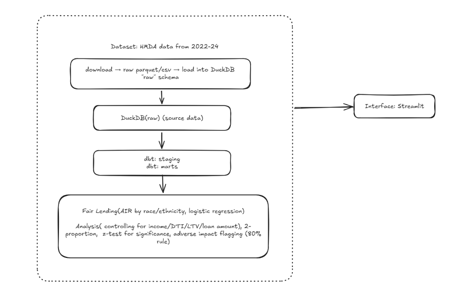

# US HMDA Fair Lending Data Pipeline

It is an end-to-end data engineering project: ingests CFPB HMDA (Home Mortgage Disclosure Act)
public loan-level data, models it with dbt on DuckDB, and runs a CFPB-style fair
lending disparity analysis (Adverse Impact Ratio, logistic regression, two-proportion
z-tests) to detect statistically significant racial approval gaps.

## Architecture





## 0. Prerequisites

- Python 3.11 (3.10+ works)
- ~2GB free disk per state/year of HMDA data you pull

## 1. Environment setup

```bash
cd hmda-fair-lending-pipeline
python3 -m venv venv
source venv/bin/activate        # Windows: venv\Scripts\activate
pip install -r requirements.txt
```

## 2. Get CFPB HMDA data

Two ways to get data:

**A) You already manually downloaded the national LAR files from the CFPB
website** (e.g. `2022_public_lar_csv.csv`, `2023_public_lar_csv.csv`, ...).
These are full national files (millions of rows, several GB each). Before
loading, verify the delimiter — CFPB's national exports are historically
**pipe-delimited (`|`)** despite the `.csv` extension:

```bash
python ingestion/inspect_source.py /path/to/2023_public_lar_csv.csv
```

Then stream all files in a directory into partitioned Parquet + a DuckDB raw
view in one step (out-of-core — handles multi-GB files regardless of RAM):

```bash
python ingestion/build_raw.py --input-dir /path/to/your/hmda_csvs --memory-limit 4GB
```

This writes compressed Parquet to `data/parquet/year=YYYY/` and creates
`raw.hmda_lar` in `data/hmda.duckdb` as a view over it — skip step 3 below,
you're done with ingestion.

**B) Pull specific states/years via the CFPB Data Browser API** (smaller,
good for fast local dev iteration):

```bash
python ingestion/download_hmda.py --states CA --years 2023
python ingestion/load_to_duckdb.py
```

## 3. Load into DuckDB

Only needed if you used path B above — `build_raw.py` in path A already does
this as part of the CSV → Parquet conversion.

```bash
python ingestion/load_to_duckdb.py
```

This creates `data/hmda.duckdb` with a `raw.hmda_lar` table.

## 4. Configure dbt

dbt-duckdb needs a `profiles.yml`. Either copy the provided example to
`~/.dbt/profiles.yml`, or set `DBT_PROFILES_DIR` to point at `dbt_project/`:

```bash
export DBT_PROFILES_DIR=$(pwd)/dbt_project
cd dbt_project
dbt deps        # if you add packages later
dbt run
dbt test
```

This builds `staging.stg_hmda_lar` and the `marts.*` tables inside the same
`data/hmda.duckdb` file.

## 5. Run the fair lending analysis

```bash
cd ..
python analysis/run_analysis.py
```

AIR and the two-proportion z-test are computed as SQL aggregations pushed
down to DuckDB directly against `marts.fct_applications` — they run against
the full population regardless of size (tens of millions of rows is fine,
these are just group-level means). The logistic regression needs row-level
data for `statsmodels`, so it draws a reproducible random sample (default
500K rows, `--regression-sample-size` to change it) rather than loading the
entire fact table into pandas.

This prints AIR by race/ethnicity, the 80% rule flag, z-test significance, and
the logistic regression coefficient on race after controlling for income,
loan amount, DTI proxy, and LTV. It also writes `data/fair_lending_results.parquet`
for the dashboard to consume.

## 6. Launch the dashboard

```bash
streamlit run dashboard/app.py
```

## Project structure

```
ingestion/
  inspect_source.py       # sniffs delimiter/schema of a raw file before a full load
  build_raw.py             # streams large national CSVs -> partitioned Parquet -> raw.hmda_lar view
  download_hmda.py         # (alt path) pulls CSVs from CFPB Data Browser API by state/year
  load_to_duckdb.py        # (alt path) loads download_hmda.py output into DuckDB raw schema
dbt_project/
  dbt_project.yml
  profiles.yml.example
  macros/
    generate_schema_name.sql  # keeps schema names exactly "staging"/"marts", no dbt "main_" prefix
  models/
    staging/
      stg_hmda_lar.sql    # decode codes, cast types, filter junk rows
      stg_hmda_lar.yml    # tests: not_null, accepted_values, relationships
    marts/
      fct_applications.sql
      dim_lender.sql
      dim_geography.sql
analysis/
  fair_lending_metrics.py # AIR, z-test, logistic regression -- both pandas and SQL-pushdown variants
  run_analysis.py         # orchestrates analysis at scale, writes results
dashboard/
  app.py                  # Streamlit UI
```

## Methodology notes

- **Adverse Impact Ratio (AIR)**: approval rate for a protected group divided by
  the approval rate for the reference group (typically White non-Hispanic
  applicants). CFPB and the DOJ commonly flag AIR < 0.80 (the "four-fifths rule")
  as a potential concern, though it's a screening heuristic, not a legal
  determination.
- **Two-proportion z-test**: tests whether the observed approval-rate gap
  between two groups is statistically significant or plausibly due to chance,
  given sample sizes.
- **Logistic regression**: models `action_taken` (approved/denied) as a
  function of race/ethnicity *plus* legitimate underwriting variables (income,
  loan amount, loan-to-value, debt-to-income bracket). A significant race
  coefficient after controlling for these is the closer analogue to what
  regulators look for — it isolates disparity that isn't explained by the
  controlled factors (note: HMDA data still lacks credit score, which is a
  known limitation of any HMDA-only fair lending analysis).


